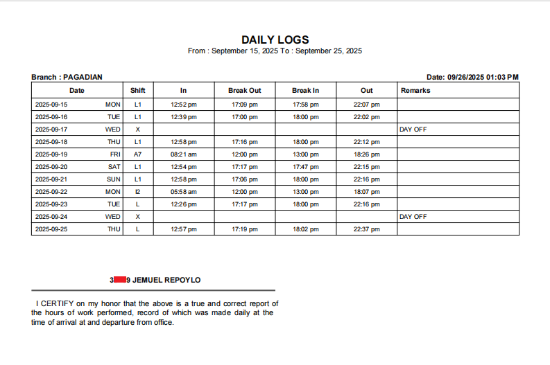

# Employee Monitoring Attendance Sheet

A modern **Next.js (TypeScript + Tailwind CSS)** web application for managing employee monitoring attendance.  
It integrates with the **Flask PDF Extraction API** to parse PDF daily logs reports and automatically extract structured attendance data using Google’s **Gemini AI**.

---

## 🚀 Features

- ⚡ **AI-Powered Extraction** — Upload PDF attendance reports and automatically extract data.
- 🧾 **Dynamic Data Display** — View parsed employee data in real time.
- 🔄 **Responsive Design** — Optimized for desktop and mobile devices.
- 🔒 **Secure API Integration** — CORS-restricted connection to Flask backend.

---

## 🧰 Tech Stack

| Layer         | Technology                                     |
| ------------- | ---------------------------------------------- |
| Framework     | [Next.js 15 (App Router)](https://nextjs.org/) |
| Language      | [TypeScript](https://www.typescriptlang.org/)  |
| Styling       | [Tailwind CSS](https://tailwindcss.com/)       |
| UI Components | [shadcn/ui](https://ui.shadcn.com/)            |
| Backend       | Flask REST API (Gemini Integration)            |
| Deployment    | [Vercel](https://vercel.com/)                  |

---

## **Before and After Comparison**

<div align="center" style="display: flex; gap: 12px; justify-content: center; align-items: flex-start;">
  
  
</div>

---

## **Sample PDF to upload**

<div align='center'>
    
</div>

---

## TODO

### 1. Email Authentication — Passwordless Sign-In & Sign-Up Flow (Intended for Yahoo users)

#### Proposed Flow (subject for change)

### A. User Enters Email

1. Check if the email exists in the Supabase `users` table.

   - **If YES (existing user):**

     - Send a **Supabase Magic Link** to the email.
     - Magic link should include an **auth redirect URL** back to the authenticated page.

   - **If NO (new user):**
     - Send a **verification code (OTP)** to the email.
     - Display an **Onboarding Form** with the following fields:
       - Verification Code
       - First Name
       - Last Name
       - Avatar Upload (optional)
     - After successful verification and form submission:
       - Create a new user record in the database.
       - Redirect user to the authenticated page.

### 2. [Done ✔] Implement Dark Mode (just a switch for simplicity)

### 3. Implement Extracting animation with stages (uploading, extracting, redirecting)

#### Example Flow (subject for change)

```js
setStage("Uploading…");

await delay(500);

setStage("Extracting data…");
const result = await extractAPI();

// success
setStage("Redirecting...");
```
