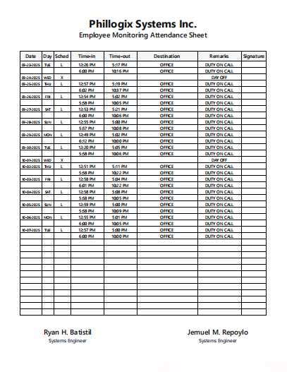

# Employee Monitoring Attendance Sheet

A modern **Next.js (TypeScript + Tailwind CSS)** web application for managing employee monitoring attendance.  
It integrates with the **Flask PDF Extraction API** to parse PDF daily logs reports and automatically extract structured attendance data using Google’s **Gemini AI**.

---

## 🚀 Features

- ⚡ **AI-Powered Extraction** — Upload PDF attendance reports and automatically extract data.
- 🧾 **Dynamic Data Display** — View parsed employee data in real time.
- 🔄 **Responsive Design** — Optimized for desktop and mobile devices.
- 🔒 **Secure API Integration** — CORS-restricted connection to Flask backend.

---

## 🧰 Tech Stack

| Layer         | Technology                                     |
| ------------- | ---------------------------------------------- |
| Framework     | [Next.js 15 (App Router)](https://nextjs.org/) |
| Language      | [TypeScript](https://www.typescriptlang.org/)  |
| Styling       | [Tailwind CSS](https://tailwindcss.com/)       |
| UI Components | [shadcn/ui](https://ui.shadcn.com/)            |
| Backend       | Flask REST API (Gemini Integration)            |
| Deployment    | [Vercel](https://vercel.com/)                  |

---

## **Before and After Comparison**

  
  

---

## **Sample PDF to upload**

    

---

## **Features**

- controllers for DB logic, actions for server-side
- Additional Considerations:

- Fetching Initial Data: Add a new server action (e.g., getSignatories) that calls getEngineerById and returns the signatories array.
- Validation: Add client-side checks (e.g., required fields) and server-side (as above).
- Testing: After implementation, run your schema migrations and test with real data. Use Drizzle's migration tools.
- Edge Cases: Handle cases where the profile doesn't exist (create it first if needed, but assume it does).
- Performance: For small arrays, this is efficient. If signatories grow, consider partial updates later.
- Security: RLS ensures users only update their own profiles.
  This plan is efficient (minimal DB calls, leverages your existing setup), secure, and follows Next.js best practices. It builds directly on your code without overhauling it. If you approve, I can implement these changes step-by-step. Let me know if you have questions or want adjustments!
